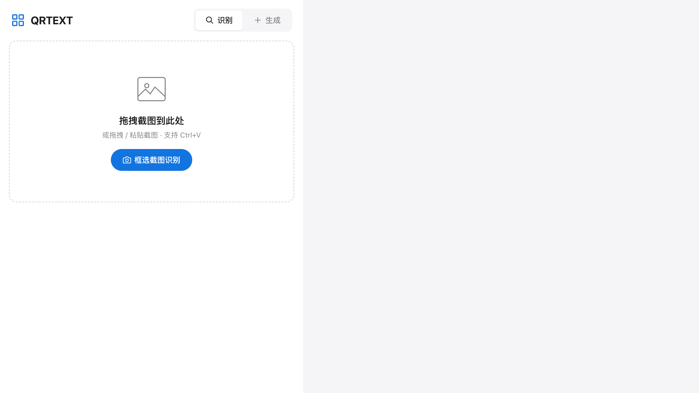
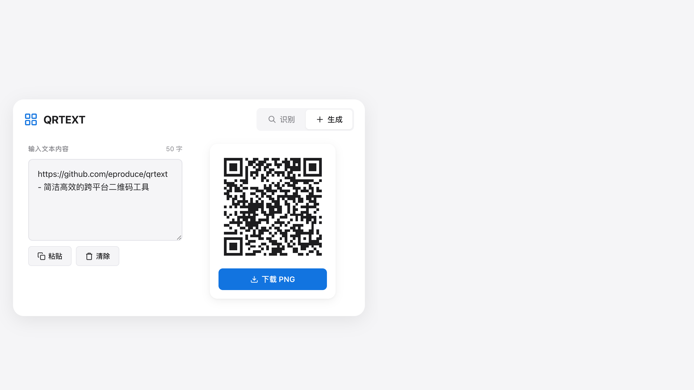

# QRTEXT

简洁高效的跨平台二维码工具 —— 截图识别 + 文本生成，一站式搞定。

## ✨ 功能

| 功能 | 说明 |
|------|------|
| 📷 **截图识别** | 调用系统原生截图工具框选区域，自动识别二维码内容 |
| 📋 **粘贴识别** | 从剪贴板粘贴截图，Ctrl+V 一键解析 |
| 📁 **拖拽识别** | 拖拽图片到窗口即可识别 |
| 🧬 **生成二维码** | 输入文本实时预览，一键下载 PNG |
| 🌍 **跨平台** | macOS / Windows / Linux 全平台原生体验 |

## 🖼️ 预览

<p align="center">
  
  &nbsp;&nbsp;
  
</p>

## 🛠️ 技术栈

| 层 | 技术 |
|----|------|
| 桌面框架 | [Tauri 2](https://tauri.app/) |
| 前端 | Vue 3 + TypeScript + Vite |
| 后端 | Rust |
| 二维码解析 | [jsQR](https://github.com/cozmo/jsQR) |
| 二维码生成 | [qrcode](https://github.com/soldair/node-qrcode) |

## 🚀 开发

### 环境要求

- Node.js ≥ 22
- Rust ≥ 1.77
- **macOS**：完整 Xcode（非仅 Command Line Tools）
- **Linux**：`libwebkit2gtk-4.1-dev` `libgtk-3-dev` 等
- **Windows**：Microsoft Visual Studio C++ Build Tools

### 启动

```bash
# 安装依赖
npm install

# 启动开发模式
npm run tauri:dev
```

### 构建

```bash
# 构建当前平台安装包
npm run tauri:build
```

## 📦 CI/CD

Push 到 `main` 分支后，GitHub Actions 自动构建三平台包：

- 🐧 Linux → `.deb` / `.AppImage`
- 🍎 macOS → `.dmg`
- 🪟 Windows → `.msi`

构建产物可在 [Actions](https://github.com/eproduce/qrtext/actions) 页面的 Artifacts 中下载。

## � 版本

当前版本：**0.4.0**

每次提交前自动升级版本号并生成 CHANGELOG：

```bash
npm run release          # patch 升级 (0.1.0 → 0.1.1)
npm run release:minor    # minor 升级 (0.1.1 → 0.2.0)
npm run release:major    # major 升级 (0.2.0 → 1.0.0)
```

脚本会自动：
1. 升级 `package.json` 和 `tauri.conf.json` 版本号
2. 从 git commit 记录生成 `CHANGELOG.md` 条目
3. 提交并打 tag

然后 `git push origin main --tags` 即可触发正式 Release。

版本变更记录请查看 [CHANGELOG.md](./CHANGELOG.md)。

## �📄 License

MIT

