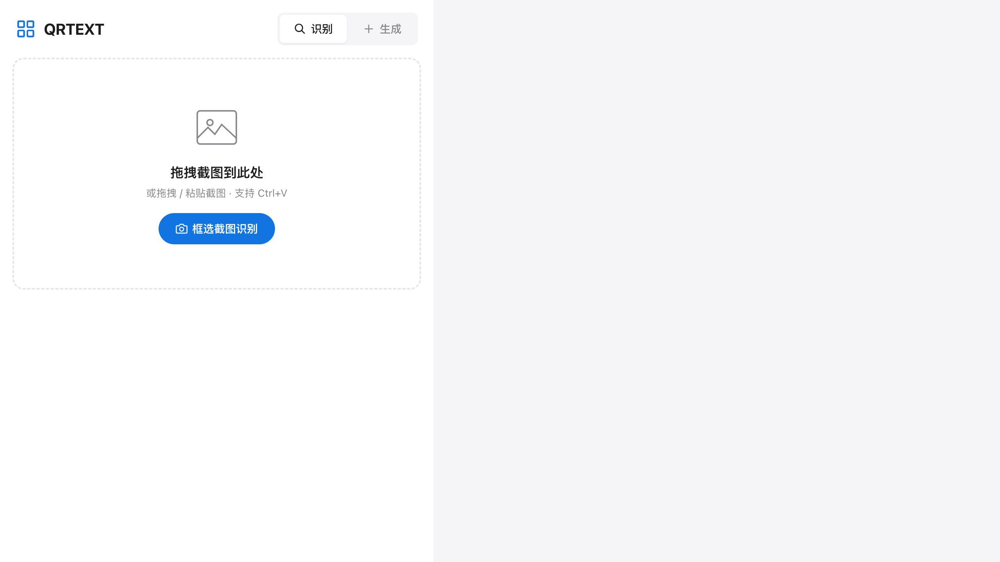
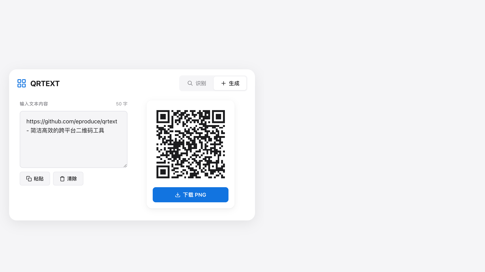

# QRTEXT

简洁高效的跨平台二维码工具 —— 截图识别 + 文本生成，一站式搞定。

## ✨ 功能

| 功能 | 说明 |
|------|------|
| 📷 **截图识别** | 调用系统原生截图工具框选区域，自动识别二维码内容 |
| 📋 **粘贴识别** | 从剪贴板粘贴截图，Ctrl+V 一键解析 |
| 📁 **拖拽识别** | 拖拽图片到窗口即可识别 |
| 🧬 **生成二维码** | 输入文本实时预览，一键下载 PNG |
| 🌍 **跨平台** | macOS / Windows / Linux 全平台原生体验 |

## 🖼️ 预览

<p align="center">
  
  &nbsp;&nbsp;
  
</p>

## 🛠️ 技术栈

| 层 | 技术 |
|----|------|
| 桌面框架 | [Electron 34](https://www.electronjs.org/) |
| 打包工具 | [electron-builder](https://www.electron.build/) |
| 前端 | Vue 3 + TypeScript + Vite |
| 二维码解析 | [jsQR](https://github.com/cozmo/jsQR) |
| 二维码生成 | [qrcode](https://github.com/soldair/node-qrcode) |

> **2026-07 从 Tauri 2 迁移至 Electron**：解决麒麟 V10 SP1 / 国产 Linux 上 glibc 版本不兼容、Windows 7 不支持 WebView2 等跨平台兼容性问题。详见 [CHANGELOG.md](./CHANGELOG.md)。

## 🚀 开发

### 环境要求

- **Node.js** ≥ 22
- **macOS / Windows / Linux** 均可

```bash
# 安装依赖
npm install

# macOS: 首次需要手动下载 Electron 二进制（npm install 的 postinstall 偶尔失败）
ELECTRON_MIRROR="https://npmmirror.com/mirrors/electron/" npm install electron
# 然后解除 macOS 隔离
xattr -cr node_modules/electron/dist/Electron.app
```

### 启动

```bash
npm run electron:dev
```

### 构建

```bash
npm run electron:build
```

## 📦 CI/CD

Push 到 `main` 分支后，GitHub Actions 自动构建三平台包：

- 🐧 Linux → `.deb` / `.rpm` / `.AppImage`
- 🍎 macOS → `.dmg`
- 🪟 Windows → `.exe` 安装包 / 绿色便携版

构建产物可在 [Actions](https://github.com/eproduce/qrtext/actions) 页面的 Artifacts 中下载。

## 🔖 版本

当前版本：**1.0.3**

版本变更记录请查看 [CHANGELOG.md](./CHANGELOG.md)。

